<div align="center">



<h1>TwinOps</h1>

<p><b>Draw your production line. Press play. See what's holding it back.</b></p>

<p>
  <a href="https://jayaragul.github.io/twinops/"><b>▶ Open the Studio</b></a> ·
  <a href="#the-60-second-version">60-second tour</a> ·
  <a href="#feeding-it-your-own-data">Your own data</a> ·
  <a href="#help-wanted">Contribute</a>
</p>

<p>
  
  
  
  
</p>

</div>

---

## The 60-second version

You manage a line. You have a hunch that one station is holding everything up, but
buying a second machine is expensive and being wrong is worse.

**TwinOps lets you test the hunch before you spend the money.**

1. Open [the Studio](https://jayaragul.github.io/twinops/) — nothing to install.
2. Describe your line in plain English, upload a spreadsheet, or drag the pieces around.
3. Press **PLAY**.

Got three machines doing the same job? That's **one card marked ×3**, not three
boxes to wire up. Tap **+** on the card to add another.

Your line runs. Buffers fill and drain. Machines turn amber when they're blocked and
blue when they're starved. The station that's actually limiting your output gets a red
ring around it, and a sentence in plain English tells you what to do about it.

> ⚠️ **Inspection Station** is limiting your output — busy 100% of the time and rarely
> waiting for parts.
>
> **What happens if you change it**
>
> | | | |
> |---|--:|--:|
> | Add one more Inspection Station (1 → 2) | **954** | **+17%** |
> | Make the buffer 4× bigger (40 → 160) | 818 | +0% |
>
> Now shipping 818 per run. Do that and **Packing Station** becomes the next limit.

Naming the constraint is a diagnosis. That table is a **decision** — TwinOps re-runs
your line with each fix applied and reports what actually changes, including which
station becomes the next limit once you've fixed this one.

It also settles the argument people get wrong. The instinct is to add storage in front
of a struggling machine. **Buffers hide a constraint; they don't remove it** — four
times the buffer bought nothing at all, while one more machine bought 17%.

Nothing there is hardcoded; the engine derives it by simulating each option.

---

## Three ways in, no wrong answer

**Type it.** Describe the line the way you'd say it out loud:

```
3 machines at 45 seconds, a buffer for 50 parts, an inspection station at 30 seconds
```

TwinOps reads the quantities and the times, and wires one shared intake into the
group — the way a real floor is laid out.

**Reuse it.** Set a machine up once — name, cycle time, how often it breaks — then
**Save to my shelf**. It stays in your browser and is one click away next time, so
you're never retyping "Oven, 8 minutes" again.

**Upload it.** Any CSV with recognisable column names. It accepts synonyms
(`machine`/`station`/`name`, `duration`/`cycle_time`/`time`, `holds`/`capacity`),
so your existing spreadsheet probably already works:

```csv
name,type,quantity,cycle_time,capacity,connects_to
Raw Material,Source,1,20s,,Cutting
Cutting,Machine,2,60s,,Staging
Staging,Buffer,1,,40,Welding
Welding,Machine,1,90s,,Finished
Finished,Sink,1,,,
```

**Drag it.** Pull pieces from the palette onto the grid and draw lines between them.
If you connect two machines directly, TwinOps quietly inserts the buffer the maths
needs — you don't have to know that rule.

Whichever way you start, you can edit everything afterwards.

---

## Feeding it your own data

Four building blocks, and that's the whole vocabulary:

| Piece | What it means on your floor |
|---|---|
| **Intake** | Where material arrives. Set how often a new part shows up. |
| **Machine** | One step of work. Set how long a part takes; optionally, how often it breaks and how long repairs take. |
| **Buffer** | A basket, rack, or bit of floor where parts wait. Set how many fit. **Its size is what causes blocking.** |
| **Shipping** | Where finished goods leave. |

Times are written the way you'd say them: `45s`, `2min`, `1.5h`. If a step varies,
say so — `{normal: {mean: 40s, sd: 4s}}` — and the run reflects that variation.

Every run is seeded, so the same seed replays identically. **"Try another day"**
re-rolls the randomness so you can see whether yesterday's number was typical or a
fluke, which is the difference between a real answer and an anecdote.

---

## Is this solving a real problem?

Partly. Here's the honest map, because you should know what else is out there
before you pick this:

| Tool | Free | No install | No code | Notes |
|---|:--:|:--:|:--:|---|
| [Siemens Plant Simulation](https://www.siemens.com/en-us/products/tecnomatix/plant-simulation-software/), [AnyLogic](https://en.wikipedia.org/wiki/AnyLogic), [Arena](https://en.wikipedia.org/wiki/List_of_discrete_event_simulation_software) | ✗ | ✗ | ✓ | The serious tools. Far more capable than this. Licences and training to match. |
| [SIMUL8 Cloud](https://www.simul8.com/) | ✗ | ✓ | ✓ | Genuinely browser-based and drag-and-drop. Commercial. |
| [JaamSim](https://github.com/jaamsim/jaamsim) | ✓ | ✗ | ✓ | Free, open source, drag-and-drop, 3D, actively maintained. **If you can install a Java desktop app, look here first.** |
| [SimPy](https://simpy.readthedocs.io/), [Salabim](https://www.salabim.org/), [Ciw](https://ciw.readthedocs.io/) | ✓ | ✗ | ✗ | Excellent Python libraries. You write the model in code. |
| **TwinOps** | ✓ | ✓ | ✓ | Runs in a browser tab. Share it as a link. Smaller feature set than any of the above. |

So no, TwinOps is not the first no-code production-line simulator, and anyone claiming
that hasn't looked. What's genuinely missing from that table is the **intersection**:
free, open source, nothing to install, no code, and shareable as a URL. That's the
corner TwinOps sits in, and it earns its place in exactly one situation —

> Someone asks *"would a second machine here help?"* and you want a defensible answer
> in the next five minutes, on a floor tablet or a locked-down work laptop where you
> cannot install anything.

If you need 3D, conveyor physics, AGV routing, or an audited model for a capital
expenditure case, use one of the tools above. TwinOps is a fast first look, not a
replacement for them.

---

## The maths underneath

The Studio is a friendly face on an ordinary, well-behaved discrete-event simulation.

- **Event-driven, not tick-driven.** Time jumps from event to event. An 8-hour shift
  costs a few thousand events instead of 28,800 idle steps — comfortably 350,000+
  events/sec on a laptop, so a full week of factory time runs in about a second.
- **Pull-with-blocking material flow.** A station pulls work when free, **blocks** when
  the next buffer is full, **starves** when its own is empty. Blocked and starved time
  are measured directly rather than inferred, which is precisely why the report can
  *name* your limiting station instead of showing you utilisation numbers and leaving
  you to work it out.
- **Deterministic.** Same seed, same run, every time. Essential when you're comparing
  two scenarios rather than admiring an animation.
- **Rendering is a consumer, never a prerequisite.** The visual layer subscribes to the
  engine's public signals (`cycle_started`, `blocked`, `received`, …) and replays them.
  The engine has no idea a UI exists.

Two bugs worth naming, since both are easy to ship by accident and neither is obvious:

**Signal handlers must not do work directly.** A push cascades into a pull, which
cascades into another push. Handle that synchronously and any realistic line
recurses until the stack dies. Signals here only queue a zero-delay wake-up, turning
recursion into iteration. There's a 60-station chain in the test suite that fails
instantly on the naive design.

**Fixed notification order silently starves parallel machines.** Two identical
machines pulling from one buffer race for every part, and whoever subscribed first
always wins — one runs at 92% while the other sits at 8%. Notification order rotates,
and a test asserts three identical machines finish within 2 parts of each other.

---

## For developers

The Studio needs no install. The Python package is for scripting, batch runs, and CI.

```bash
pip install -e .

twin show  examples/line_a.twin            # print the object tree
twin run   examples/line_a.twin --for 8h   # simulate, report KPIs
twin sweep examples/line_a.twin --runs 20  # variance across 20 seeds
twin ui    examples/line_a.twin --for 8h   # standalone HTML replay you can email
```

Build a model in code when you want to generate or parameterise it:

```python
from twinops import Factory, Area, Source, Machine, Buffer, Sink
from twinops import SimulationEngine, analyse

b_in  = Buffer("Buffer_In", capacity=25)
b_out = Buffer("Buffer_Out", capacity=50)

line = Area("Line_A").add(
    b_in, b_out,
    Source("Raw_Intake", interval="25s").feeds(b_in),
    Machine("CNC_01", cycle_time="40s", mtbf="45min", mttr="6min")
        .fed_by(b_in).feeds(b_out),
    Sink("Shipping").fed_by(b_out),
)

engine = SimulationEngine(Factory("Demo").add(line), seed=1)
engine.run(8 * 3600)
print(analyse(engine).render())
```

Add your own machine types — the `.twin` loader picks them up from the registry:

```python
from twinops import Machine, REGISTRY

class PaintBooth(Machine):
    type_name = "PaintBooth"

REGISTRY["PaintBooth"] = PaintBooth
```

```bash
pip install -e ".[dev]" && pytest -q     # 30 tests
```

Tests cover the object tree, event ordering, **material conservation** (nothing is
created or lost), backpressure, determinism, parallel fairness, constraint detection,
and the file format.

---

## Help wanted

The engine is solid. The gaps are in everything around it, and most are small enough
for a first-time contributor. Issues tagged
[`good first issue`](https://github.com/Jayaragul/twinops/labels/good%20first%20issue)
are scoped deliberately small.

**Genuinely useful right now**

- **Shift patterns and breaks.** Real lines stop for lunch. Nothing models that yet, and
  it changes every number on the report.
- **Changeover / setup time.** Switching a machine from product A to product B costs
  time — tool changes, die swaps, cleaning. Entirely missing here.
- **Batch processing.** Ovens, curing racks and plating tanks process 50 units at once,
  not one at a time.
- **Excel import** (`.xlsx`) alongside the existing CSV path.
- **Share a layout by URL** — encode the model in the fragment so a link reproduces it.
- **Cost modelling.** Throughput is only half the argument; managers ask about money.

**Bigger swings**

- **Live data.** Read OPC-UA or MQTT so the twin tracks the real floor instead of a guess.
- **Optimiser.** Given a budget, search layouts for the best throughput per unit spent.
- **Better plain-English parsing.** The current parser is regex-based and easily fooled.
- **Validation against a real line.** *The single most valuable contribution anyone
  could make.* If you have real throughput data, model it and tell us where the
  simulation is wrong. Correctness beats features.

**Not sure where to start?** Open an issue describing your line — what it makes, where it
jams. Turning real floors into worked examples is genuinely useful, and no code required.

See [CONTRIBUTING.md](CONTRIBUTING.md).

---

## Licence

MIT — use it for your hackathon, your thesis, or your plant.

<div align="center">
<sub>Built by <a href="https://github.com/Jayaragul">Jayaragul N</a> · Coimbatore, India</sub>
</div>
